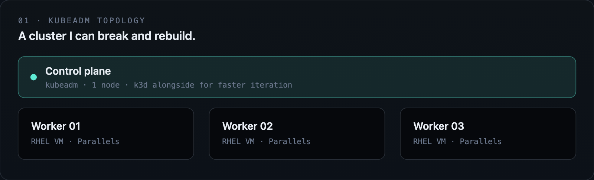

<div align="center">


# Zaheer Abbas

**Quality Engineer** with ~11 years in Selenium-based test automation, moving into **cloud platform architecture** — Kubernetes, RHEL, and AWS.

Hyderabad · Available for hire · CKA in progress — not earned yet

[GitHub](https://github.com/zaheer1247) · [LinkedIn](https://www.linkedin.com/in/zaheer1247/) · [Live portfolio](https://zaheer1247-github-io.vercel.app)

</div>

---

### 01 — Home lab

A cluster I can break and rebuild. Practice environment for Kubernetes operations, observability, and infrastructure as code — not a production claim.

<div align="center">



</div>

<details>
<summary>Text topology</summary>

```text
                    ┌─────────────────────────────────────┐
                    │     CONTROL PLANE  ·  kubeadm × 1    │
                    │     k3d alongside for faster loops   │
                    └──────────────┬──────────────────────┘
           ┌───────────────────────┼───────────────────────┐
           ▼                       ▼                       ▼
    ┌────────────┐          ┌────────────┐          ┌────────────┐
    │ Worker 01  │          │ Worker 02  │          │ Worker 03  │
    │  RHEL VM   │          │  RHEL VM   │          │  RHEL VM   │
    └────────────┘          └────────────┘          └────────────┘
```

</details>

| Host | Cluster | Alongside |
| --- | --- | --- |
| MacBook Pro M4 Max · RHEL 9/10 under Parallels | kubeadm: 1 control plane + 3 workers | k3d for faster iteration |

| Observability | Automation | Runtime |
| --- | --- | --- |
| Prometheus, Node Exporter, Grafana | Ansible, Terraform — reusable scripts and golden images over one-off commands | Podman, containerd, Docker — depending on the exercise |

---

### 02 — Public projects

Six repos that show the shift. Each link is the public GitHub repository.

| # | Project | What it is |
| ---: | --- | --- |
| 01 | [Flask + Jenkins + Docker CI/CD](https://github.com/zaheer1247/DevopsPrj1_Flask_Web_App_With_CI_CD) | Commit-to-container pipeline for a Flask app |
| 02 | [Microservices architecture](https://github.com/zaheer1247/DevopsPrj2_Microservices_Architecture) | Python, Flask, Docker, PostgreSQL, Redis |
| 03 | [Kubernetes cluster management](https://github.com/zaheer1247/DevopsPrj3_Kubernetes_Cluster_Management) | Cluster ops on Kubernetes |
| 04 | [AWS Terraform IaC](https://github.com/zaheer1247/devops-project4-aws-terraform-infrastructure-as-code) | Infrastructure as code on AWS |
| 05 | [Monitoring and alerting](https://github.com/zaheer1247/DevopsPrj5_Monitoring_and_Alerting) | Prometheus + Grafana |
| 06 | [Portfolio](https://github.com/zaheer1247/zaheer1247.github.io) | Source on GitHub · live: [zaheer1247-github-io.vercel.app](https://zaheer1247-github-io.vercel.app) |

---

### 03 — Stack

Tools in active use.

<div align="center">


</div>

Kubernetes · RHEL · Terraform · AWS · Prometheus / Grafana · Ansible · Docker / Podman · Jenkins

---

### 04 — Certifications

**In progress. None earned yet.** Sequence is deliberate: CKA first, then the rest. Do not treat any of these as completed certifications.

| Now | Then, in this order |
| --- | --- |
| **CKA** — Certified Kubernetes Administrator, studying first | CKS · RHCSA · RHCE · Terraform Associate · AWS SAA · Prometheus Certified Associate |

---

<div align="center">

### Contact

Hyderabad. Available for hire.

[github.com/zaheer1247](https://github.com/zaheer1247) · [LinkedIn](https://www.linkedin.com/in/zaheer1247/) · [zaheer1247-github-io.vercel.app](https://zaheer1247-github-io.vercel.app)

</div>
