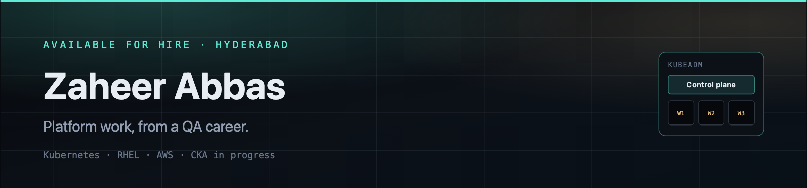

# Zaheer Abbas

**AI systems and cloud infrastructure** — learning how LLMs and agents meet real clusters, not just chat windows.

I run Kubernetes, IaC, and observability in a home lab, and I use generative AI as a daily engineering practice. Direction: quality engineering → cloud/Kubernetes → AI infrastructure → LLM systems and agents.

Hyderabad · Available for hire · Currently studying: CKA

[GitHub](https://github.com/zaheer1247)  · [LinkedIn](https://www.linkedin.com/in/zaheer1247/) · [Live portfolio](https://zaheer1247-github-io.vercel.app)

---

## What I'm building

Studying **generative AI** in parallel with **CKA**. Daily work happens with Claude Pro, Cursor, and ChatGPT Codex — how I write, debug, and operate, not products I shipped.

Interest now: LLM/agent workflows as a practitioner, and the **infrastructure those systems need** (Kubernetes, containers, metrics). Planning toward becoming an AI generalist. This is a study path, not a research appointment.

Public AI-adjacent work today is the Kubernetes agent in featured work. More GenAI repos will land here when they are real.

<!-- TODO: add public GenAI repo when published -->

---

## Featured work

Infrastructure and platform repos, plus one public LLM agent on Kubernetes.

<table>
<tr>
<td valign="top" width="50%">

**[Gemini DevOps agent for Kubernetes](https://github.com/zaheer1247/DevopsPrj3_Kubernetes_Cluster_Management)**  
Natural-language cluster ops: Gemini + LangChain tools wrap `kubectl` (deploy, list, delete, status).  
*Why it matters:* public example of an LLM agent driving real cluster actions — study work, not a paper.  
`Python` `Gemini` `LangChain` `Kubernetes`

</td>
<td valign="top" width="50%">

**[AWS Terraform IaC](https://github.com/zaheer1247/devops-project4-aws-terraform-infrastructure-as-code)**  
Provision and manage cloud infrastructure with Terraform.  
*Why it matters:* repeatable AWS instead of console clicking.  
`Terraform` `AWS` `HCL`

</td>
</tr>
<tr>
<td valign="top" width="50%">

**[Monitoring and alerting](https://github.com/zaheer1247/DevopsPrj5_Monitoring_and_Alerting)**  
Prometheus + Grafana for metrics and dashboards.  
*Why it matters:* you cannot run AI or cluster workloads you cannot see.  
`Prometheus` `Grafana` `Shell`

</td>
<td valign="top" width="50%">

**[Flask + Jenkins + Docker CI/CD](https://github.com/zaheer1247/DevopsPrj1_Flask_Web_App_With_CI_CD)**  
Commit-to-container pipeline for a Flask app.  
*Why it matters:* the delivery path workloads still need.  
`Python` `Flask` `Jenkins` `Docker`

</td>
</tr>
<tr>
<td valign="top" width="50%">

**[Microservices architecture](https://github.com/zaheer1247/DevopsPrj2_Microservices_Architecture)**  
Python/Flask services with Docker, PostgreSQL, and Redis.  
*Why it matters:* multi-service runtime, cache, and data — not a single container.  
`Python` `Flask` `Docker` `PostgreSQL` `Redis`

</td>
<td valign="top" width="50%">

**[Portfolio](https://github.com/zaheer1247/zaheer1247.github.io)**  
Personal site. Live: [zaheer1247-github-io.vercel.app](https://zaheer1247-github-io.vercel.app)  
*Why it matters:* the public narrative next to the repos.  
`HTML`

</td>
</tr>
</table>

---

## Research / AI exploration

Study notes, not a publication list. Topics I am working through:

- Generative AI and LLM systems (how models are used in tools and workflows)
- Agents: tool-calling loops against real APIs and clusters
- AI infrastructure: running and observing workloads on Kubernetes
- Toward an AI generalist practice alongside CKA

---

## Infrastructure lab

Break it, rebuild it, automate it, observe it. Practice cluster — not a production claim.

MacBook Pro M4 Max · RHEL 9/10 under Parallels · kubeadm (1 control plane + 3 workers) · k3d for faster loops · Prometheus, Node Exporter, Grafana · Ansible, Terraform, golden images · Podman, containerd, Docker

---

## Stack

| | |
| --- | --- |
| **AI / ML** | Generative AI (study) · LLM/agent workflows · Claude Pro · Cursor · ChatGPT Codex |
| **Infrastructure** | Kubernetes · kubeadm · k3d · RHEL |
| **Cloud** | AWS · Terraform |
| **Containers** | Docker · Podman · containerd |
| **Observability** | Prometheus · Node Exporter · Grafana |
| **Automation** | Ansible · reusable scripts · golden VM images |
| **CI/CD** | Jenkins |

---

## Background

~11 years in software quality and Selenium-based test automation (RealPage QE). That work is how I learned to treat systems as something you verify, break, and make repeatable — the same habits I use on clusters and on AI tooling.

Path I am on: **Software quality & automation → cloud/infrastructure → Kubernetes → AI infrastructure → LLM/AI systems → agents.**

---

## Certifications

**Currently studying: CKA**

Then, in this order: CKS · RHCSA · RHCE · Terraform Associate · AWS SAA · Prometheus Certified Associate

---

Hyderabad · Available for hire

[github.com/zaheer1247](https://github.com/zaheer1247) · [LinkedIn](https://www.linkedin.com/in/zaheer1247/) · [zaheer1247-github-io.vercel.app](https://zaheer1247-github-io.vercel.app)

